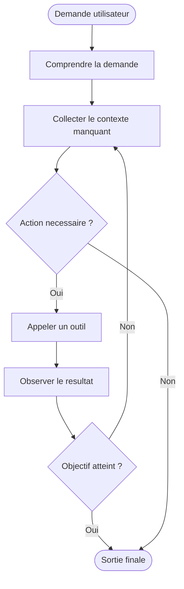
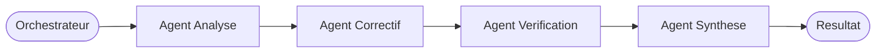
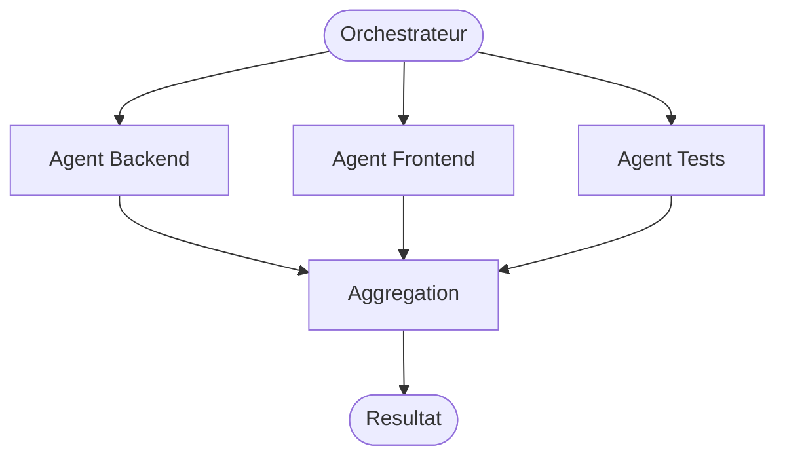
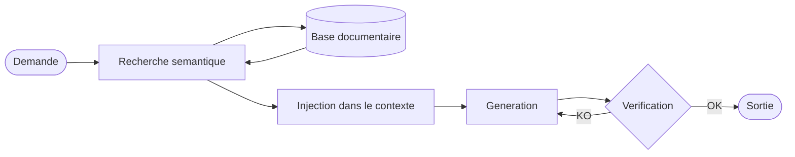

# Fonctionnement agentic

## Vue d'ensemble

Quand un developpeur utilise un assistant de code ou un agent, il ne parle pas seulement a un modele. Il interagit avec un systeme compose de plusieurs couches :

1. un modele, souvent un LLM ;
2. un ensemble d'instructions qui encadrent son comportement ;
3. un contexte courant, construit a partir de la demande et de l'environnement ;
4. des outils qu'il peut appeler ;
5. une boucle de decision qui determine quoi faire ensuite.

Cette distinction est essentielle. Beaucoup d'erreurs viennent du fait qu'on attribue au modele ce qui releve en realite de l'outil, du contexte ou de la configuration produit.

## Prompt, instruction et demande utilisateur

### Prompt

Dans le langage courant, on appelle souvent prompt tout le texte qu'on envoie a un systeme d'IA. En pratique, un modele recoit un assemblage de plusieurs couches, pas un simple message :

- **System prompt** : couche d'instructions stables injectees par le produit ou le depot. Elle definit le role, le style, les contraintes et les outils disponibles. L'utilisateur ne la voit generalement pas.
- **Historique** : la conversation precedente (questions + reponses precedentes), selectionnee selon la taille de la fenetre de contexte.
- **Message utilisateur** : la demande courante.

Cette distinction est importante parce que deux outils peuvent produire des reponses tres differentes a une demande identique si leurs system prompts divergent. Les fichiers `instructions/` d'un depot alimentent typiquement la couche system.

Exemple simplifie de ce que recoit le modele :

```text
[SYSTEM]
Tu es un assistant de code. Respecte le style du depot.
Ne touche pas aux tests existants. Langue : francais.

[HISTORY]
User: explique cette fonction
Assistant: Cette fonction fait X...

[USER]
Corrige le bug ligne 42 sans changer la signature.
```

### Instruction

Une instruction est une regle ou une contrainte qui oriente le comportement du systeme. Exemple : respecter le style du depot, ne pas toucher aux tests existants, toujours verifier les erreurs avant de conclure.

Les instructions peuvent venir :

- du produit ;
- du depot ;
- de l'equipe ;
- de l'utilisateur lui-meme.

### Demande utilisateur

La demande utilisateur est l'objectif local exprime dans l'interaction courante. Exemple : expliquer une erreur, corriger un bug, ecrire un plan, comparer deux options.

Une bonne demande ne remplace pas de bonnes instructions. Elle s'appuie dessus.

## Comment le contexte est construit

Le contexte reunit ce que le systeme choisit d'envoyer au modele au moment de produire une reponse. Dans un environnement de dev, cela peut inclure :

- la conversation recente ;
- la selection courante dans l'editeur ;
- des fichiers ouverts ou recherches ;
- la structure du workspace ;
- des diagnostics de compilation ou de linter ;
- des regles de projet ;
- des resultats d'outils ;
- des documents recuperes via RAG.

Le point critique est la selection. Meme avec une grande fenetre de contexte, il faut arbitrer entre bruit et signal.

## Boucle agentique

Une boucle agentique typique ressemble a ceci :

1. comprendre la demande ;
2. collecter le contexte manquant ;
3. decider d'une action ;
4. appeler un outil si necessaire ;
5. observer le resultat ;
6. ajuster le plan ;
7. produire une sortie finale ou relancer un cycle.



Cette boucle peut etre tres courte ou plus longue selon l'autonomie accordee. Un agent de type assistant de code travaille souvent dans une boucle compacte : lecture, recherche, modification, verification, synthese.

## Pourquoi les outils changent tout

Sans outils, un LLM produit une reponse a partir de texte deja disponible. Avec outils, il peut :

- lire l'etat reel d'un depot ;
- lancer des tests ;
- rechercher du code ;
- recuperer des erreurs reelles ;
- modifier des fichiers ;
- interroger un service externe.

La difference pratique est majeure : on passe d'une assistance purement speculative a une assistance reliee a un environnement d'execution ou de travail.

## Sous-agents

Un sous-agent est un agent appele par un autre agent (l'orchestrateur) pour prendre en charge une sous-tache specifique. Il recoit une instruction, un contexte propre et produit une sortie precise.

Pourquoi isoler une tache dans un sous-agent :

- **Contexte propre** : le sous-agent ne voit que ce qui est pertinent pour sa tache. Cela evite la saturation du contexte principal et reduit les erreurs par distraction.
- **Sortie definie** : l'interface est claire (entree → traitement → sortie). Le resultat peut etre verifie avant d'etre transmis a l'agent principal.
- **Restrictions d'outils** : un sous-agent peut avoir acces a un sous-ensemble d'outils seulement, ce qui limite la surface de risque.
- **Reutilisabilite** : un meme sous-agent peut etre appele depuis differents workflows ou orchestrateurs.

Exemple typique : un agent principal analyse un probleme, puis delegue la verification des tests a un sous-agent specialise, et la generation de la documentation a un autre.

## Orchestration d'agents

L'orchestration designe la coordination de plusieurs agents qui travaillent ensemble pour accomplir une tache complexe. Un orchestrateur decide qui fait quoi, dans quel ordre, et comment les resultats sont combines.

### Modeles courants

**Sequentiel** : les agents s'exectuent l'un apres l'autre. La sortie de l'un devient l'entree du suivant.



**Parallele** : plusieurs agents travaillent en meme temps sur des parties independantes d'une tache.



**Hierarchique** : des sous-orchestrateurs gèrent chacun un groupe d'agents specialises.

### Quand c'est utile

- La tache est trop longue ou complexe pour un contexte unique.
- Differentes parties de la tache requierent des expertises ou des outils distincts.
- On veut paralleliser des traitements independants.

### Limites et risques

- Plus d'agents signifie plus de points de defaillance potentiels.
- Les erreurs se propagent : si un agent produit une mauvaise sortie, les agents suivants travaillent sur de mauvaises bases.
- La coordination a un cout : chaque appel de sous-agent consomme du contexte et du temps de traitement.
- Deboguer un systeme multi-agents est plus difficile qu'un agent unique.

## MCP

MCP signifie Model Context Protocol. C'est une maniere standardisee d'exposer a un modele ou a un agent des ressources et des outils externes.

Du point de vue developpeur, l'interet est simple : au lieu d'integrer chaque source de contexte ou chaque outil de facon ad hoc, on peut fournir une interface plus uniforme pour acceder a des fichiers, des bases documentaires, des APIs ou des actions specialisees.

Il faut cependant distinguer :

- le protocole lui-meme ;
- les serveurs MCP qui exposent des capacites ;
- l'outil client qui decide comment utiliser ces capacites.

## RAG dans une boucle agentique

Dans un produit agentic, un RAG sert souvent a recuperer des informations avant la generation. Exemple : retrouver les pages de doc interne pertinentes sur un framework maison avant de proposer une modification.



## Modes d'echec frequents

### Manque de contexte

Le systeme repond de maniere generique, invente des details ou suit une mauvaise hypothese.

### Mauvaises instructions

Les contraintes sont contradictoires, implicites ou insuffisamment precises. L'agent fait alors quelque chose de plausible mais hors cible.

### Outils mal utilises

L'outil existe, mais n'est pas appele au bon moment ou son resultat est mal interprete.

### Confiance excessive

La reponse semble claire, donc elle n'est pas reverifiee. C'est un risque classique avec du code ou des explications techniques bien formulees.

## Ce que cela change pour un developpeur

Un bon usage des assistants IA repose moins sur une phrase magique que sur la capacite a :

- definir un objectif precis ;
- fournir le bon contexte ;
- demander une verification quand c'est necessaire ;
- distinguer ce qui doit etre prouve de ce qui peut rester exploratoire ;
- traiter l'assistant comme un systeme outille, pas comme une autorite.