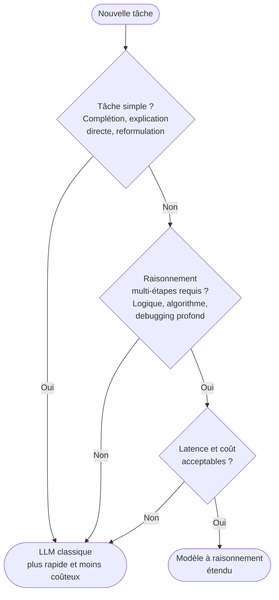

# Extended Thinking (raisonnement étendu)

## LLM classique vs modèle à raisonnement étendu

| | LLM classique | Raisonnement étendu |
|---|---|---|
| **Comportement** | Répond directement | Génère une chaîne de réflexion interne avant de répondre |
| **Latence** | Faible | Élevée (la « réflexion » prend du temps) |
| **Coût** | Par token de sortie | Tokens de raisonnement + tokens de sortie |
| **Idéal pour** | Complétions, reformulations, explications simples | Problèmes complexes, multi-étapes, logique imbriquée |
| **Exemples** | GPT-4o, Claude 3.5 Sonnet, Gemini Pro | o1, o3, Claude Extended Thinking, Gemini Thinking |

## Comment ça fonctionne

Le modèle produit d'abord un bloc de raisonnement interne (souvent appelé « scratchpad » ou « thinking »). Ce bloc n'est généralement pas visible dans la réponse finale, mais il influence la qualité du résultat. Le modèle arrive à la réponse après avoir exploré des hypothèses, des contre-exemples et des stratégies différentes.

Ce n'est pas de la magie : c'est une variation du principe chain-of-thought, mais intégrée nativement dans le modèle et non demandée explicitement par l'utilisateur.

## Quand l'utiliser — arbre de décision rapide

## Bonnes pratiques

- Ne pas utiliser pour des complétions simples ou des tâches itératives à fort volume.
- Privilégier pour les sessions de debugging profond ou de conception, pas pour l'usage quotidien de base.
- Vérifier que l'outil ou le produit expose bien le modèle à raisonnement étendu (tous les clients ne le font pas).
- Comparer les résultats avec un LLM classique avant de systématiser : le gain justifie rarement le surcoût sur des tâches standard.