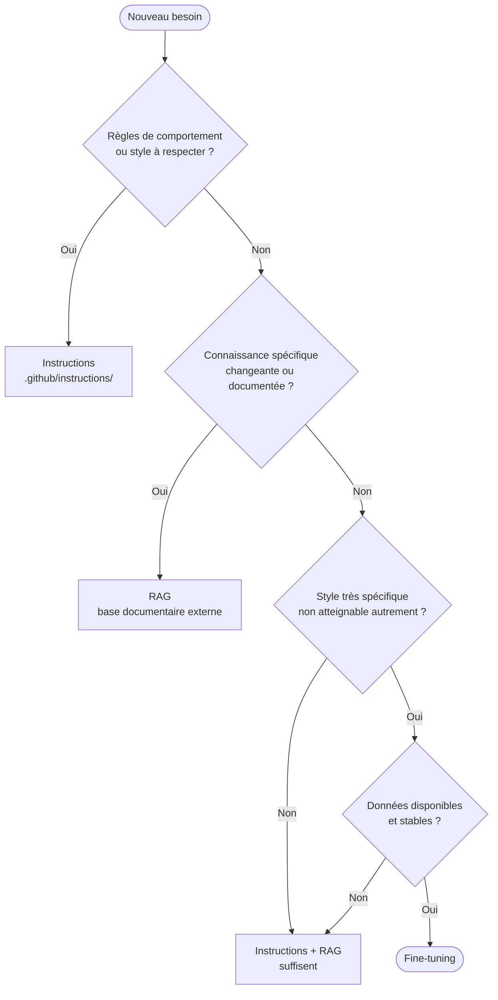

# Fine-tuning

## RAG, instructions ou fine-tuning ?

Le choix n'est pas toujours évident. Voici un arbre de décision :



Les trois ne s'excluent pas : un modèle fine-tuné peut aussi utiliser du RAG et des instructions.

## Limites à connaître

- Le fine-tuning ne « met pas à jour la connaissance du monde » : il change des
  comportements, pas la base statistique du modèle sur des faits récents.
- Un modèle fine-tuné peut toujours halluciner sur des sujets hors corpus.
- Le coût en données, en calcul et en maintenance est significatif.
- Un mauvais corpus de fine-tuning peut dégrader les performances générales.

## Convention de fichiers proposée

Si vous travaillez sur un projet de fine-tuning, les artefacts associés peuvent
être documentés dans le dépôt :

```text
.github/
  instructions/
    fineTuning-guidelines.instructions.md  ← règles de construction du corpus

.claude/
  context/
    fine-tuning-status.md  ← état courant : version, données, métriques
```