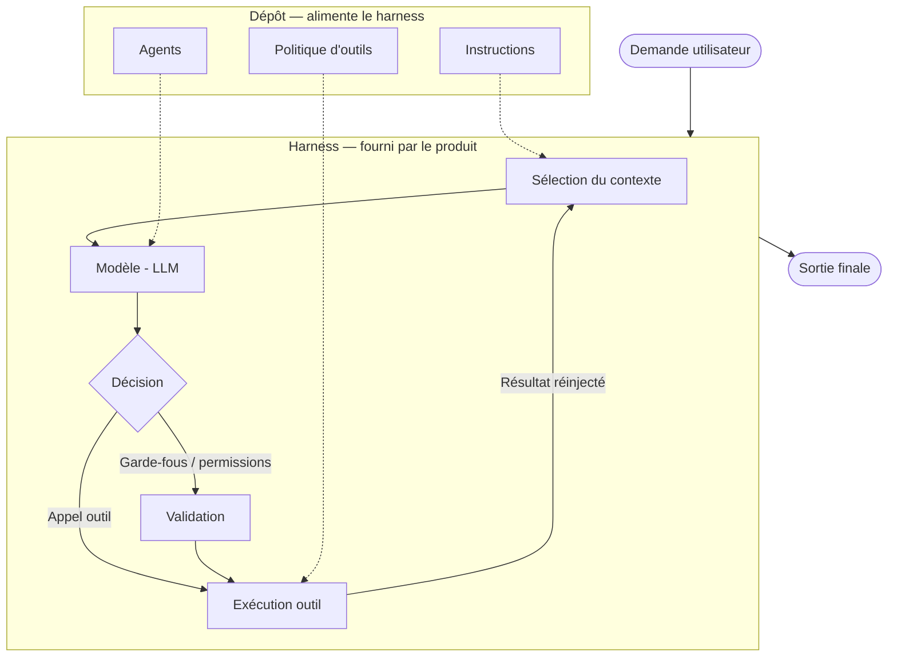

# Harness

## De quoi parle-t-on ?

Le **harness** (échafaudage d'exécution) est l'ensemble des couches qui enveloppent le modèle et le transforment en agent. Un LLM seul ne fait que prédire du texte. C'est le harness autour de lui — boucle de décision, contexte, outils, garde-fous — qui lui permet d'agir sur un environnement réel.

Autrement dit : le modèle est le moteur, le harness est la mécanique qui en fait un véhicule.

## Ce que contient un harness

- **Boucle de décision** : comprendre, agir, observer, ajuster — le cycle qui relance le modèle tant que l'objectif n'est pas atteint (voir [Boucle agentique](../guide/02-fonctionnement.md#boucle-agentique)).
- **Assemblage et sélection du contexte** : choisir ce qui est envoyé au modèle (conversation, fichiers, résultats d'outils, RAG) et arbitrer entre bruit et signal.
- **Exécution des outils** : appeler les outils demandés par le modèle, puis réinjecter leurs résultats dans le contexte (voir [function calling](../guide/02-fonctionnement.md#génération-structurée-et-function-calling)).
- **Garde-fous et permissions** : ce que l'agent a le droit de faire, les validations requises avant une action à fort impact.
- **Compression du contexte et gestion de l'historique** : libérer de l'espace quand la fenêtre sature, décider ce qui est conservé d'un tour à l'autre.

Aucune de ces couches n'est le modèle. Toutes conditionnent pourtant le comportement final.

Le modèle (`M`) n'est qu'un maillon. Tout ce qui l'entoure — la boucle, les flèches, les couches — c'est le harness. Le dépôt (en pointillés) ne remplace aucune couche : il les alimente.

## Fourni par le produit, alimenté par le dépôt

Point essentiel : le harness est **fourni par l'outil** (Claude Code, Copilot, Cursor, Cline…), pas configuré dans votre dépôt. Vous ne l'écrivez pas — vous l'alimentez.

Ce que le dépôt configure vient *nourrir* le harness sans le remplacer :

- les [instructions](instruction.md) alimentent la couche system du contexte ;
- les [agents](agent.md) et sous-agents définissent des rôles que le harness orchestre ;
- la [politique d'outils](tool.md) restreint ce que le harness a le droit d'exécuter.

Le dépôt règle les paramètres ; le harness fait tourner la machine.

## Ce que cela change pour un développeur

- À **modèle identique**, deux harness produisent des comportements très différents. Comparer deux outils, c'est surtout comparer leurs harness, pas leurs modèles.
- Beaucoup d'erreurs viennent du harness — contexte mal sélectionné, outil mal câblé, garde-fou absent — pas du modèle. Diagnostiquer suppose de savoir distinguer les deux.
- Améliorer un résultat passe souvent par agir sur ce qu'on peut configurer (instructions, contexte, outils), pas par attendre un meilleur modèle.

## Erreurs fréquentes

- **Confondre modèle et agent** : croire que le modèle « est » l'agent. Le modèle prédit ; le harness agit.
- **Attribuer au modèle ce qui relève du harness** : un mauvais résultat est souvent un problème de contexte ou d'outillage, pas de capacité du modèle.
