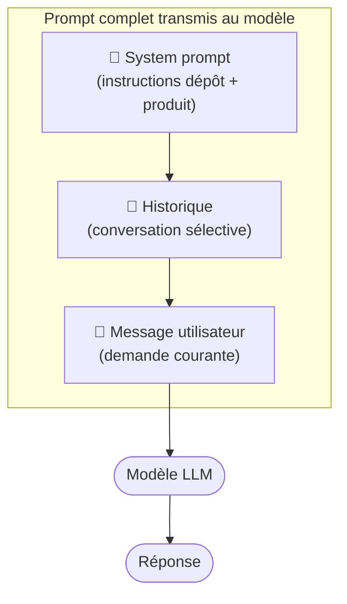

# Prompt (.github / .claude)

## Les trois couches d'un prompt

En pratique, un modèle ne reçoit pas seulement votre message. Il reçoit un assemblage de plusieurs couches :

| Couche | Contenu | Qui le contrôle |
|--------|---------|----------------|
| **System** | Rôle, comportement, contraintes, style, outils | Produit ou dépôt (`instructions/`) |
| **Historique** | Conversation précédente (questions + réponses) | L'outil, sélectionné selon la mémoire |
| **User** | La demande courante | L'utilisateur |



Exemple concret d'un message assemblé (simplifié) :

```text
[SYSTEM]
Tu es un assistant de code. Respecte le style du dépôt.
Ne touche pas aux tests existants. Langue : français.

[HISTORY]
User: explique cette fonction
Assistant: Cette fonction fait X...

[USER]
Corrige le bug ligne 42 sans changer la signature.
```

Ce que ça change pour vous :

- Deux outils avec des system prompts différents donneront des réponses différentes à la même demande.
- Vos fichiers `instructions/` alimentent le system prompt.
- Vous ne voyez généralement pas les couches system et history dans l'interface.

## Convention de fichiers proposée

```text
.github/
  prompts/
    explain-tradeoff.prompt.md

.claude/
  prompts/
    refactor-minimal.prompt.md
```

## Exemple de prompt template

```md
---
mode: ask
description: "Comparer deux options techniques avec risques et coûts."
---

Contexte :
- Stack : {{stack}}
- Contrainte : {{constraint}}

Demande :
Compare Option A vs Option B.
Donne :
1. impact performance
2. impact maintenabilité
3. risques migration
4. recommandation argumentée
```