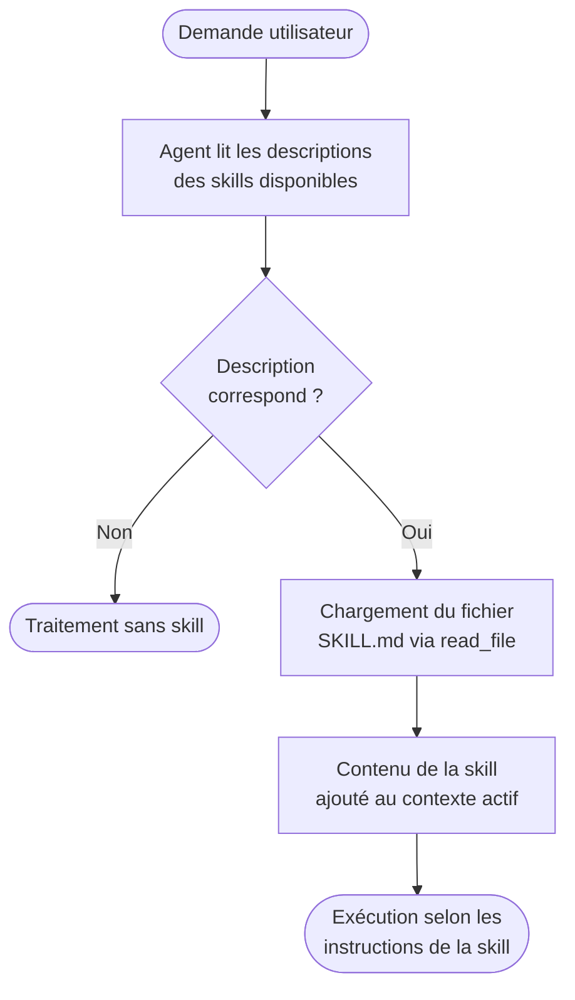

# Skills (.github / .claude)

## Convention de fichiers proposée

```text
.github/
  skills/
    api-review/
      SKILL.md
      checklist.md
      templates/
        review-template.md

.claude/
  skills/
    migration-assistant/
      SKILL.md
      playbook.md
```

## Exemple minimal de SKILL.md

```md
---
name: api-review
description: "Use when reviewing API breaking changes and compatibility risks."
---

# API Review Skill

Objectif :
- Détecter breaking changes
- Évaluer impact backward compatibility
- Proposer mitigations

Sortie attendue :
1. Findings critiques
2. Questions ouvertes
3. Plan de correction
```

## Comment une skill est découverte et chargée

Les skills ne sont pas chargées automatiquement au démarrage. Elles sont **découvrables à la demande**. Voici le flux complet :



Implication pratique : une skill avec une description vague ou absente ne sera
jamais déclenchée automatiquement. La clé est dans le champ `description`.

Exemple de description efficace :

```yaml
---
name: security-review
description: "Use when reviewing authentication, authorization, input validation,
              or any security-sensitive code. Triggers on mentions of JWT, OAuth,
              SQL queries, user inputs, or permissions."
---
```