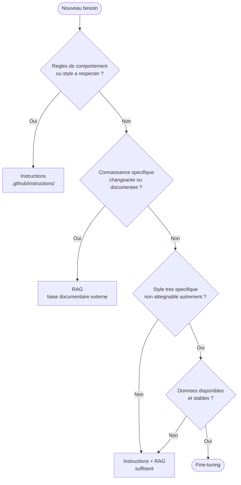

# Fine-tuning

## Rappel express

Definition canonique : voir [01-fondamentaux.md](../01-fondamentaux.md#fine-tuning).
Cette fiche se concentre surtout sur l'usage concret du concept.

## A quoi sert ce concept

Comprendre le fine-tuning sert a savoir quand il vaut mieux adapter le modele lui-meme plutot que de jouer sur les instructions ou le RAG.

- Pour ancrer un style de sortie tres specifique (format, vocabulaire, ton propriétaire).
- Pour eviter de repeter les memes exemples en contexte a chaque interaction.
- Pour adapter un modele general a un domaine metier tres different du pre-entrainement.
- Pour comprendre pourquoi, dans la majorite des cas, ce n'est pas la bonne option.

## RAG, instructions ou fine-tuning ?

Le choix n'est pas toujours evident. Voici un arbre de decision :



Les trois ne s'excluent pas : un modele fine-tune peut aussi utiliser du RAG et des instructions.

## Limites a connaitre

- Le fine-tuning ne "met pas a jour la connaissance du monde" : il change des
  comportements, pas la base statistique du modele sur des faits recents.
- Un modele fine-tune peut toujours halluciner sur des sujets hors corpus.
- Le cout en donnees, en calcul et en maintenance est significatif.
- Un mauvais corpus de fine-tuning peut degrader les performances generales.

## Convention de fichiers proposee

Si vous travaillez sur un projet de fine-tuning, les artefacts associes peuvent
etre documentes dans le depot :

```text
.github/
  instructions/
    fineTuning-guidelines.instructions.md  ← regles de construction du corpus

.claude/
  context/
    fine-tuning-status.md  ← etat courant : version, donnees, metriques
```

## Navigation

- Retour a l'index des fiches : [06-fiches-detaillees.md](../06-fiches-detaillees.md)
- Voir aussi : [fiches/rag.md](rag.md)
- Voir aussi le glossaire : [glossaire.md](../glossaire.md)
