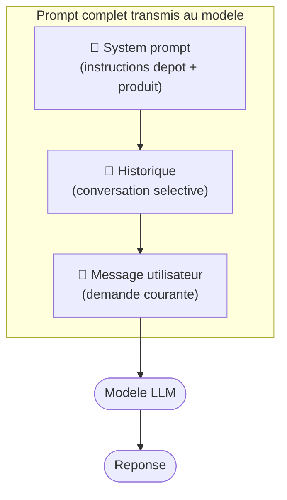

# Prompt (.github / .claude)

## Rappel express

Definition canonique : voir [02-fonctionnement-agentic.md](../02-fonctionnement-agentic.md) et [03-outils-ecosysteme.md](../03-outils-ecosysteme.md).
Cette fiche se concentre surtout sur l'usage concret du concept.

## A quoi sert ce concept

Comprendre le prompt sert a piloter la forme et le niveau de precision de la sortie.

- Pour formuler clairement l'objectif et les contraintes.
- Pour demander un format de reponse exploitable (plan, patch, tableau, checklist).
- Pour reduire les aller-retours en explicitant ce qui est attendu des le debut.
- Pour separer demande ponctuelle (prompt) et regles stables (instructions).

## Les trois couches d'un prompt

En pratique, un modele ne recoit pas seulement votre message. Il recoit un assemblage de plusieurs couches :

| Couche | Contenu | Qui le controle |
|--------|---------|----------------|
| **System** | Role, comportement, contraintes, style, outils | Produit ou depot (`instructions/`) |
| **Historique** | Conversation precedente (questions + reponses) | L'outil, selectionne selon la memoire |
| **User** | La demande courante | L'utilisateur |



Exemple concret d'un message assemble (simplifie) :

```text
[SYSTEM]
Tu es un assistant de code. Respecte le style du depot.
Ne touche pas aux tests existants. Langue : francais.

[HISTORY]
User: explique cette fonction
Assistant: Cette fonction fait X...

[USER]
Corrige le bug ligne 42 sans changer la signature.
```

Ce que ca change pour vous :

- Deux outils avec des system prompts differents donneront des reponses differentes a la meme demande.
- Vos fichiers `instructions/` alimentent le system prompt.
- Vous ne voyez generalement pas les couches system et history dans l'interface.

## Convention de fichiers proposee

```text
.github/
  prompts/
    explain-tradeoff.prompt.md

.claude/
  prompts/
    refactor-minimal.prompt.md
```

## Exemple de prompt template

```md
---
mode: ask
description: "Comparer deux options techniques avec risques et couts."
---

Contexte:
- Stack: {{stack}}
- Contrainte: {{constraint}}

Demande:
Compare Option A vs Option B.
Donne:
1. impact perf
2. impact maintenabilite
3. risques migration
4. recommandation argumentee
```

## Navigation

- Retour a l'index des fiches : [06-fiches-detaillees.md](../06-fiches-detaillees.md)
- Voir aussi le glossaire : [glossaire.md](../glossaire.md)