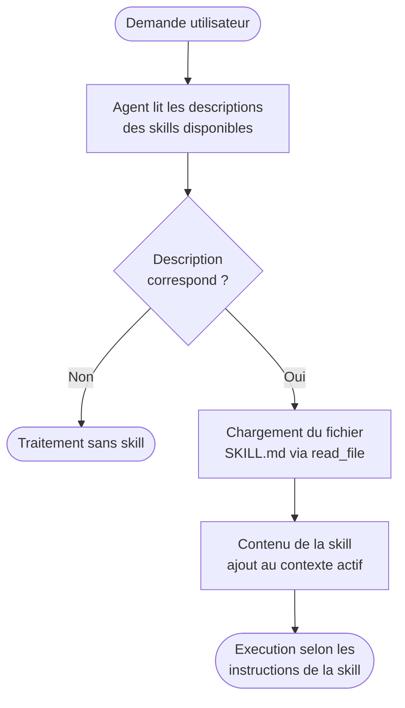

# Skills (.github / .claude)

## Rappel express

Definition canonique : voir [03-outils-ecosysteme.md](../03-outils-ecosysteme.md) et [05-fichiers-et-conventions.md](../05-fichiers-et-conventions.md).
Cette fiche se concentre surtout sur l'usage concret du concept.

## A quoi sert ce concept

Comprendre les skills sert a encapsuler une methode specialisee reutilisable.

- Pour accelerer des taches recurrentes (review API, migration, perf, securite).
- Pour transmettre une expertise d'equipe sous forme operationnelle.
- Pour standardiser le format de sortie attendu selon le type de mission.
- Pour reduire la dependance aux personnes "expertes" sur un sujet donne.

## Convention de fichiers proposee

```text
.github/
  skills/
    api-review/
      SKILL.md
      checklist.md
      templates/
        review-template.md

.claude/
  skills/
    migration-assistant/
      SKILL.md
      playbook.md
```

## Exemple minimal de SKILL.md

```md
---
name: api-review
description: "Use when reviewing API breaking changes and compatibility risks."
---

# API Review Skill

Objectif:
- Detecter breaking changes
- Evaluer impact backward compatibility
- Proposer mitigations

Sortie attendue:
1. Findings critiques
2. Questions ouvertes
3. Plan de correction
```

## Comment une skill est decouverte et chargee

Les skills ne sont pas chargees automatiquement au demarrage. Elles sont **decouvrables a la demande**. Voici le flux complet :



Implication pratique : une skill avec une description vague ou absente ne sera
jamais declenchee automatiquement. La cle est dans le champ `description`.

Exemple de description efficace :

```yaml
---
name: security-review
description: "Use when reviewing authentication, authorization, input validation,
              or any security-sensitive code. Triggers on mentions of JWT, OAuth,
              SQL queries, user inputs, or permissions."
---
```

## Navigation

- Retour a l'index des fiches : [06-fiches-detaillees.md](../06-fiches-detaillees.md)
- Voir aussi le glossaire : [glossaire.md](../glossaire.md)