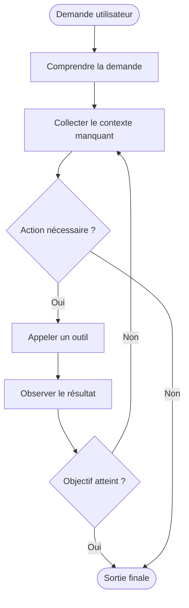
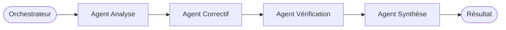
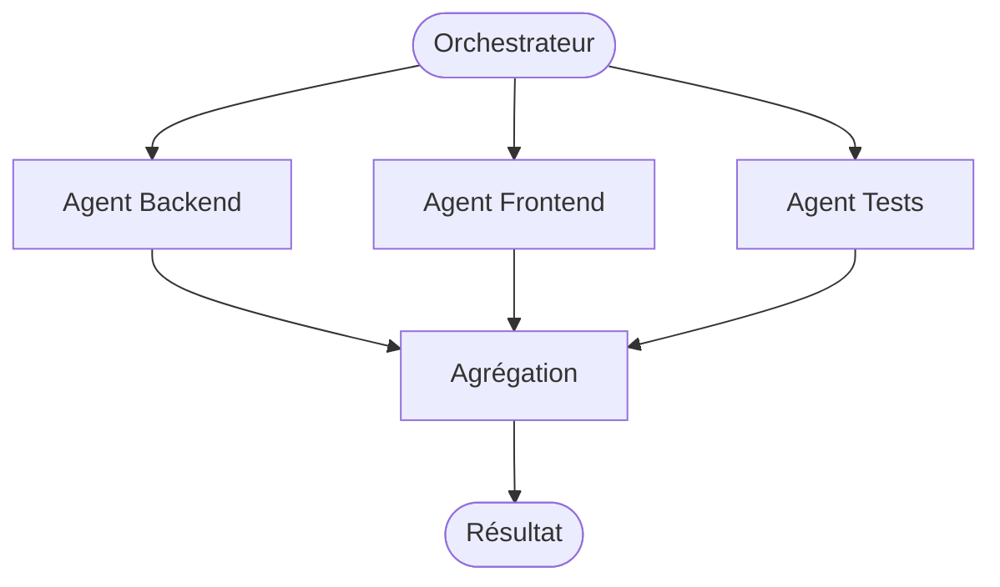
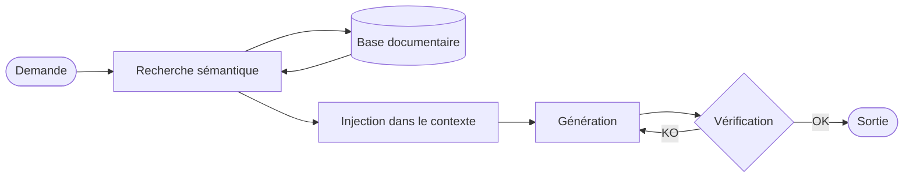

# Fonctionnement agentic

## Vue d'ensemble

Quand un développeur utilise un assistant de code ou un agent, il ne parle pas seulement à un modèle. Il interagit avec un système composé de plusieurs couches :

1. un modèle, souvent un LLM ;
2. un ensemble d'instructions qui encadrent son comportement ;
3. un contexte courant, construit à partir de la demande et de l'environnement ;
4. des outils qu'il peut appeler ;
5. une boucle de décision qui détermine quoi faire ensuite.

Cette distinction est essentielle. Beaucoup d'erreurs viennent du fait qu'on attribue au modèle ce qui relève en réalité de l'outil, du contexte ou de la configuration produit.

## Prompt, instruction et demande utilisateur

### Prompt

Dans le langage courant, on appelle souvent prompt tout le texte qu'on envoie à un système d'IA. En pratique, un modèle reçoit un assemblage de plusieurs couches, pas un simple message :

- **System prompt** : couche d'instructions stables injectées par le produit ou le dépôt. Elle définit le rôle, le style, les contraintes et les outils disponibles. L'utilisateur ne la voit généralement pas.
- **Historique** : la conversation précédente (questions + réponses précédentes), sélectionnée selon la taille de la fenêtre de contexte.
- **Message utilisateur** : la demande courante.

Cette distinction est importante parce que deux outils peuvent produire des réponses très différentes à une demande identique si leurs system prompts divergent. Les fichiers `instructions/` d'un dépôt alimentent typiquement la couche system.

Exemple simplifié de ce que reçoit le modèle :

```text
[SYSTEM]
Tu es un assistant de code. Respecte le style du dépôt.
Ne touche pas aux tests existants. Langue : français.

[HISTORY]
User: explique cette fonction
Assistant: Cette fonction fait X...

[USER]
Corrige le bug ligne 42 sans changer la signature.
```

### Instruction

Une instruction est une règle ou une contrainte qui oriente le comportement du système. Exemple : respecter le style du dépôt, ne pas toucher aux tests existants, toujours vérifier les erreurs avant de conclure.

Les instructions peuvent venir :

- du produit ;
- du dépôt ;
- de l'équipe ;
- de l'utilisateur lui-même.

### Demande utilisateur

La demande utilisateur est l'objectif local exprimé dans l'interaction courante. Exemple : expliquer une erreur, corriger un bug, écrire un plan, comparer deux options.

Une bonne demande ne remplace pas de bonnes instructions. Elle s'appuie dessus.

## Comment le contexte est construit

Le contexte réunit ce que le système choisit d'envoyer au modèle au moment de produire une réponse. Dans un environnement de dev, cela peut inclure :

- la conversation récente ;
- la sélection courante dans l'éditeur ;
- des fichiers ouverts ou recherchés ;
- la structure du workspace ;
- des diagnostics de compilation ou de linter ;
- des règles de projet ;
- des résultats d'outils ;
- des documents récupérés via RAG.

Le point critique est la sélection. Même avec une grande fenêtre de contexte, il faut arbitrer entre bruit et signal.

### Context compression

Quand la fenêtre de contexte se sature — conversation longue, nombreux fichiers ouverts, historique étendu — le système peut compresser le contexte pour libérer de l'espace. Deux techniques courantes :

- **Résumé glissant** : les échanges les plus anciens sont remplacés par un résumé synthétique. La fidélité diminue mais l'essentiel est conservé.
- **Suppression sélective** : les tours jugés peu pertinents pour la tâche courante sont retirés. Risque de perdre un élément utile silencieusement.

Implication pratique : dans une session longue, la qualité peut se dégrader progressivement sans que ce soit visible. Recommencer une session propre sur une nouvelle tâche est souvent préférable à une longue conversation accumulée.

## Boucle agentique

Une boucle agentique typique ressemble à ceci :

1. comprendre la demande ;
2. collecter le contexte manquant ;
3. décider d'une action ;
4. appeler un outil si nécessaire ;
5. observer le résultat ;
6. ajuster le plan ;
7. produire une sortie finale ou relancer un cycle.



Cette boucle peut être très courte ou plus longue selon l'autonomie accordée. Un agent de type assistant de code travaille souvent dans une boucle compacte : lecture, recherche, modification, vérification, synthèse.

Ce patron est connu sous le nom de **ReAct** (Reasoning + Acting). Il structure la boucle en trois opérations cycliques : raisonner sur la situation, agir via un outil, observer le résultat. La majorité des frameworks agentiques (LangGraph, AutoGen, Semantic Kernel) implémentent ce patron sous une forme ou une autre.

## Pourquoi les outils changent tout

Sans outils, un LLM produit une réponse à partir de texte déjà disponible. Avec outils, il peut :

- lire l'état réel d'un dépôt ;
- lancer des tests ;
- rechercher du code ;
- récupérer des erreurs réelles ;
- modifier des fichiers ;
- interroger un service externe.

La différence pratique est majeure : on passe d'une assistance purement spéculative à une assistance reliée à un environnement d'exécution ou de travail.

## Génération structurée et function calling

Un LLM produit naturellement du texte libre. Pour qu'un agent puisse agir de façon fiable, il faut que ce texte soit prédictible et parseable. Deux mécanismes résolvent ce problème.

### Génération structurée

La génération structurée contraint le modèle à produire une sortie conforme à un schéma — typiquement du JSON validé. Cela permet à l'agent de traiter la réponse comme une donnée, pas comme du texte à analyser.

Exemple : au lieu de recevoir « Je pense qu'il faut modifier le fichier utils.ts », l'agent reçoit :

```json
{
  "action": "edit_file",
  "path": "src/utils.ts",
  "reason": "correction du bug de validation"
}
```

### Function calling

Le function calling est la mécanique par laquelle un modèle indique qu'il veut appeler un outil, en spécifiant le nom de la fonction et les arguments à lui passer. L'outil est exécuté par le système (pas par le modèle), et le résultat est réinjecté dans le contexte.

Flux simplifié :

```
1. Utilisateur : "Quels sont les fichiers modifiés aujourd'hui ?"
2. Modèle → demande d'appel : { "function": "list_files", "args": {"since": "today"} }
3. Système exécute list_files()
4. Résultat réinjecté dans le contexte
5. Modèle génère la réponse finale avec les vraies données
```

Pourquoi c'est la base de la fiabilité en production :

- Un agent qui produit du texte libre peut se tromper de format ou d'interprétation.
- Un agent qui utilise le function calling a une interface définie, testable et versionnée.
- La génération structurée permet des tests unitaires sur les décisions de l'agent (pas seulement sur le texte final).

## Sous-agents

Un sous-agent est un agent appelé par un autre agent (l'orchestrateur) pour prendre en charge une sous-tâche spécifique. Il reçoit une instruction, un contexte propre et produit une sortie précise.

Pourquoi isoler une tâche dans un sous-agent :

- **Contexte propre** : le sous-agent ne voit que ce qui est pertinent pour sa tâche. Cela évite la saturation du contexte principal et réduit les erreurs par distraction.
- **Sortie définie** : l'interface est claire (entrée → traitement → sortie). Le résultat peut être vérifié avant d'être transmis à l'agent principal.
- **Restrictions d'outils** : un sous-agent peut avoir accès à un sous-ensemble d'outils seulement, ce qui limite la surface de risque.
- **Réutilisabilité** : un même sous-agent peut être appelé depuis différents workflows ou orchestrateurs.

Exemple typique : un agent principal analyse un problème, puis délègue la vérification des tests à un sous-agent spécialisé, et la génération de la documentation à un autre.

## Orchestration d'agents

L'orchestration désigne la coordination de plusieurs agents qui travaillent ensemble pour accomplir une tâche complexe. Un orchestrateur décide qui fait quoi, dans quel ordre, et comment les résultats sont combinés.

### Modèles courants

**Séquentiel** : les agents s'exécutent l'un après l'autre. La sortie de l'un devient l'entrée du suivant.



**Parallèle** : plusieurs agents travaillent en même temps sur des parties indépendantes d'une tâche.



**Hiérarchique** : des sous-orchestrateurs gèrent chacun un groupe d'agents spécialisés.

### Quand c'est utile

- La tâche est trop longue ou complexe pour un contexte unique.
- Différentes parties de la tâche requièrent des expertises ou des outils distincts.
- On veut paralléliser des traitements indépendants.

### Limites et risques

- Plus d'agents signifie plus de points de défaillance potentiels.
- Les erreurs se propagent : si un agent produit une mauvaise sortie, les agents suivants travaillent sur de mauvaises bases.
- La coordination a un coût : chaque appel de sous-agent consomme du contexte et du temps de traitement.
- Déboguer un système multi-agents est plus difficile qu'un agent unique.

## MCP

MCP signifie Model Context Protocol. C'est une manière standardisée d'exposer à un modèle ou à un agent des ressources et des outils externes.

Du point de vue développeur, l'intérêt est simple : au lieu d'intégrer chaque source de contexte ou chaque outil de façon ad hoc, on peut fournir une interface plus uniforme pour accéder à des fichiers, des bases documentaires, des APIs ou des actions spécialisées.

Il faut cependant distinguer :

- le protocole lui-même ;
- les serveurs MCP qui exposent des capacités ;
- l'outil client qui décide comment utiliser ces capacités.

## RAG dans une boucle agentique

Dans un produit agentic, un RAG sert souvent à récupérer des informations avant la génération. Exemple : retrouver les pages de doc interne pertinentes sur un framework maison avant de proposer une modification.



## Modes d'échec fréquents

### Manque de contexte

Le système répond de manière générique, invente des détails ou suit une mauvaise hypothèse.

### Mauvaises instructions

Les contraintes sont contradictoires, implicites ou insuffisamment précises. L'agent fait alors quelque chose de plausible mais hors cible.

### Outils mal utilisés

L'outil existe, mais n'est pas appelé au bon moment ou son résultat est mal interprété.

### Confiance excessive

La réponse semble claire, donc elle n'est pas revérifiée. C'est un risque classique avec du code ou des explications techniques bien formulées.

## Ce que cela change pour un développeur

Un bon usage des assistants IA repose moins sur une phrase magique que sur la capacité à :

- définir un objectif précis ;
- fournir le bon contexte ;
- demander une vérification quand c'est nécessaire ;
- distinguer ce qui doit être prouvé de ce qui peut rester exploratoire ;
- traiter l'assistant comme un système outillé, pas comme une autorité.

---

*Guide · Chapitre 2 sur 5*

[← Index](../index.md) | **Précédent ←** [Fondamentaux](01-fondamentaux.md) | **Suivant →** [Outils et écosystème](03-outils.md)