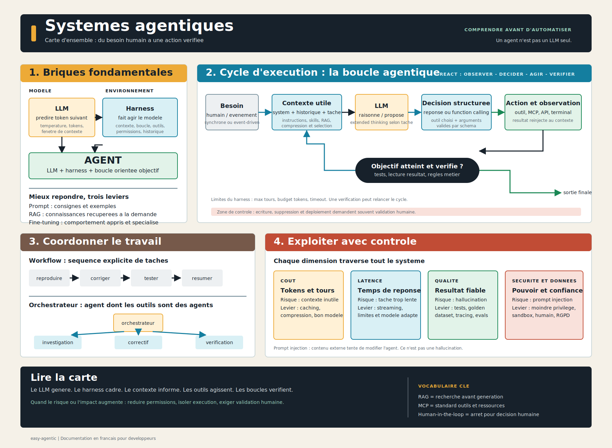
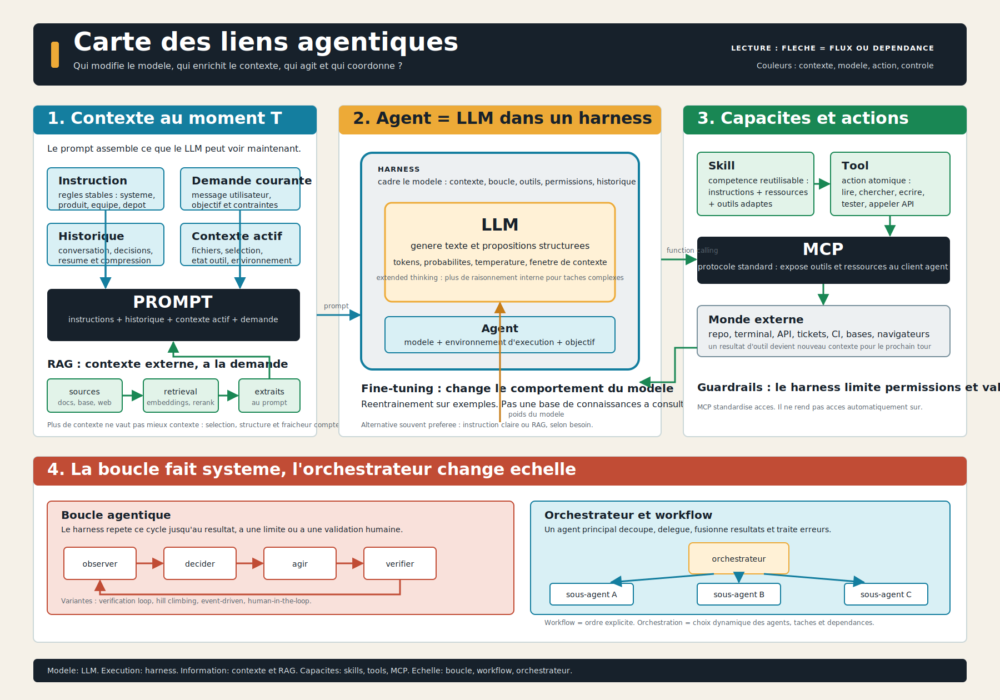

# easy-agentic

Repères sur l'environnement agentic pour les développeurs — comprendre avant d'automatiser.

---

## Vue d'ensemble

Cette carte relie le LLM, le harness, le contexte, les outils, les boucles de vérification, l'orchestration et les garde-fous.

Cette seconde carte sépare les rôles : le contexte informe, le LLM génère, le harness exécute, les outils agissent et l'orchestrateur coordonne.

---

## Guide

| # | Chapitre | Contenu |
| --- | ---------- | --------- |
| 1 | [Fondamentaux](guide/01-fondamentaux.md) | Vocabulaire de base : IA, LLM, tokens, contexte, température, modèles ouverts/fermés |
| 2 | [Fonctionnement agentic](guide/02-fonctionnement.md) | Boucle agentique, outils, function calling, sous-agents, orchestration |
| 3 | [Outils et écosystème](guide/03-outils.md) | Copilot, Claude Code, Cursor, Cline, Aider, MCP |
| 4 | [Fichiers et conventions](guide/04-conventions.md) | Conventions `.github` / `.claude`, formalisation des règles d'équipe |
| 5 | [Pratiques développeur](guide/05-pratiques.md) | Méthodes de travail, évals, observabilité, sécurité, RGPD |

---

## Concepts

| Fiche | Résumé |
| ------- | -------- |
| [Agent](concepts/agent.md) | Système combinant modèle, contexte, outils et boucle orientée objectif |
| [Boucles agentiques](concepts/boucles.md) | Agent loop, ReAct, vérification, événementielle, hill climbing |
| [Contexte](concepts/context.md) | Ce que le modèle voit réellement et comment c'est construit |
| [Coût et performance](concepts/cout-performance.md) | Tokens, prompt caching, contexte long, latence — leviers concrets |
| [Extended Thinking](concepts/extended-thinking.md) | Modèles à raisonnement étendu : quand et comment les utiliser |
| [Fine-tuning](concepts/fine-tuning.md) | Réentraînement partiel — tableau de décision vs RAG vs instructions |
| [Harness](concepts/harness.md) | Échafaudage d'exécution qui transforme le modèle en agent |
| [Instruction](concepts/instruction.md) | Règles stables de comportement : où les placer, comment les écrire |
| [LLM](concepts/llm.md) | Le moteur de prédiction : ce qu'il fait vraiment |
| [MCP](concepts/mcp.md) | Model Context Protocol : exposition d'outils et de ressources |
| [Orchestrateur](concepts/orchestrateur.md) | Agent qui coordonne plusieurs agents — qui fait quoi, dans quel ordre |
| [Prompt](concepts/prompt.md) | Assemblage des couches du prompt, techniques de formulation |
| [RAG](concepts/rag.md) | Retrieval-Augmented Generation : enrichir le contexte depuis une base |
| [Sécurité agentique](concepts/securite.md) | Modèle de menace : injection, jailbreak, sandbox, red teaming |
| [Skills](concepts/skills.md) | Compétences spécialisées exposées à l'agent |
| [Tool](concepts/tool.md) | Actions externes appelables par l'agent |
| [Workflow](concepts/workflow.md) | Séquences de travail organisées entre humain, agent et outils |

---

## Référence

- [Tableaux comparatifs](reference/comparatifs.md) — LLM vs agent, RAG vs fine-tuning, modes Copilot, outils de dev IA
- [Structure du dossier `.github`](reference/github-folder.md) — vue d'ensemble complète : GitHub natif + conventions IA
- [FAQ](reference/faq.md) — réponses aux questions fréquentes
- [Glossaire](reference/glossaire.md) — définitions courtes de tous les termes
- [Idées reçues](reference/idees-recues.md) — ce qui est souvent mal compris
